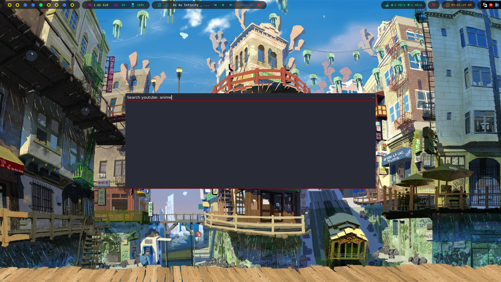
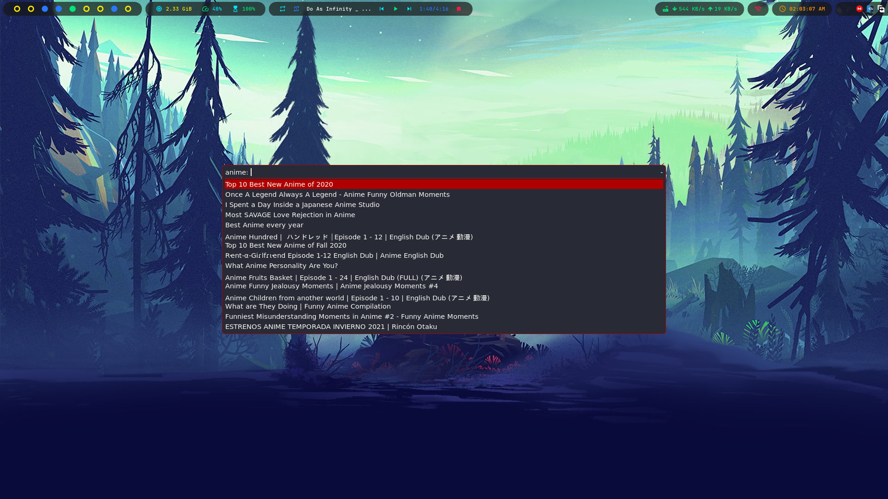

# Rofi youtube searcher

A simple rofi/python script that allows an in-rofi-youtube-search and allows it to be played in local video player

requirements :youtube-search-python, mpv, rofi, python

install the python module using this command
pip install youtube-search-python

